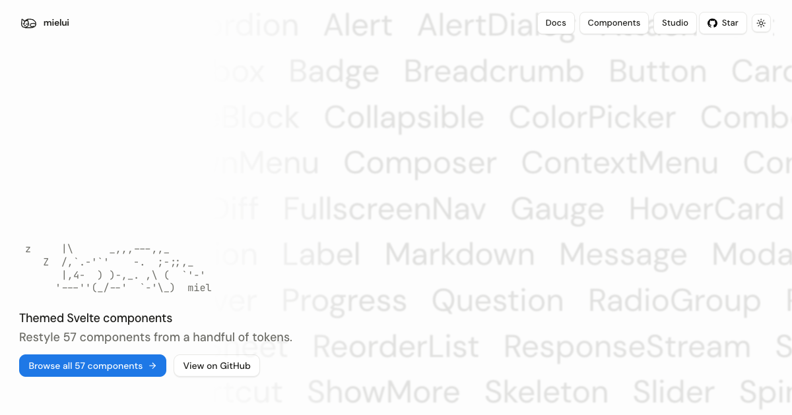

# Mielui

Svelte components for building interfaces with a shared visual system. Use them as shipped, or copy the source and make them your own.

 [](https://www.npmjs.com/package/@mielui/svelte)



## Documentation

Visit [ui.miel.my/docs/introduction](https://ui.miel.my/docs/introduction) for the documentation.

## Agent skill

Install the Mielui skill for component guidance, API references, and examples:

```sh
npx skills add mielsense/mielui --skill mielui
```

## Contributing

Please open an issue or pull request to contribute. See [CONTRIBUTING.md](CONTRIBUTING.md) for the workflow and [SETUP.md](SETUP.md) for local setup, deployment, and publishing.

## License

Maintained by [mielsense](https://github.com/mielsense). Licensed under the [MIT license](./LICENSE). See [UPSTREAM.md](UPSTREAM.md) for upstream attribution.
